# Схема электрическая подключений (Схема соединений)
## Датчик ДВУ-01, блоки грозозащиты (УЗП-24, УЗЛ-И) и конвертер

Настоящий документ содержит схему внешних электрических соединений оборудования при установке датчика ветра ДВУ-01 на мачте. Схема включает блоки грозозащиты (УЗП-24 для питания, УЗЛ-И для интерфейса RS-485), плату конвертера, внешнее питание, токовые петли 4-20 мА и отладочный интерфейс.

## 1. Интерактивный векторный чертеж (SVG)

Для полноэкранного просмотра схемы с интерактивной подсветкой цепей при наведении курсора откройте файл в любом веб-браузере: **[docs/connection_diagram.svg](file:///c:/src/VNIIM/wtrans/docs/connection_diagram.svg)**


---

## 2. Структурная схема соединений (Mermaid)

Ниже представлена структурная блок-схема соединений. Для корректного отображения используйте средство просмотра Markdown с поддержкой Mermaid.

```mermaid
flowchart TB
    %% Определение стилей для красивого современного вида
    classDef mast fill:#1e293b,stroke:#38bdf8,stroke-width:2px,color:#f8fafc
    classDef sensor fill:#0f172a,stroke:#0ea5e9,stroke-width:2px,color:#f8fafc
    
    classDef cabinet fill:#1e293b,stroke:#64748b,stroke-width:2px,color:#f8fafc
    classDef uzp fill:#3b2314,stroke:#f97316,stroke-width:2px,color:#fed7aa
    classDef uzl fill:#38161a,stroke:#ef4444,stroke-width:2px,color:#fee2e2
    classDef conv fill:#143b23,stroke:#22c55e,stroke-width:2px,color:#dcfce7
    
    classDef external fill:#1e293b,stroke:#a855f7,stroke-width:2px,color:#f8fafc
    classDef ground fill:#14532d,stroke:#4ade80,stroke-width:2px,color:#dcfce7
    
    %% Описание линий связи
    linkStyle default stroke:#94a3b8,stroke-width:1px;
    style PWR_L_P stroke:#f97316,stroke-width:2px,stroke-dasharray: none
    style PWR_L_N stroke:#64748b,stroke-width:2px,stroke-dasharray: none
    style PWR_S_P stroke:#f97316,stroke-width:2px,stroke-dasharray: none
    style PWR_S_N stroke:#64748b,stroke-width:2px,stroke-dasharray: none
    style RS_S_A stroke:#38bdf8,stroke-width:2px,stroke-dasharray: 5 5
    style RS_S_B stroke:#0ea5e9,stroke-width:2px,stroke-dasharray: 5 5
    style RS_L_A stroke:#38bdf8,stroke-width:2px,stroke-dasharray: 5 5
    style RS_L_B stroke:#0ea5e9,stroke-width:2px,stroke-dasharray: 5 5
    style PE_line stroke:#22c55e,stroke-width:3px,stroke-dasharray: 2 2
    style PE_sens stroke:#22c55e,stroke-width:2px,stroke-dasharray: 2 2

    %% ПОДГРУППА 1: НА МАЧТЕ (OUTDOOR)
    subgraph MAST["Мачта (Уличная установка)"]
        direction TB
        SENS["<b>Датчик ветра ДВУ-01</b><br>Параметры: 24В DC, RS-485"]
        S_V_P["+24V (Питание)"]
        S_V_N["0V (Питание)"]
        S_PE["PE / Экран"]
        S_A["A (+) RS-485"]
        S_B["B (-) RS-485"]
        
        SENS --- S_V_P
        SENS --- S_V_N
        SENS --- S_PE
        SENS --- S_A
        SENS --- S_B
    end

    %% ПОДГРУППА 2: ШКАФ АВТОМАТИКИ / МОНТАЖНЫЙ ШКАФ
    subgraph CABINET["Шкаф защиты и коммутации"]
        direction TB
        
        %% Блок защиты питания
        subgraph UZP["УЗП-24DC/5 <br>(Защита цепи питания)"]
            direction LR
            %% Аппаратура (левая сторона по схеме)
            subgraph UZP_APP["Аппаратура"]
                UZP_7["клемма 7 (A1)"]
                UZP_9["клемма 9 (A2)"]
            end
            %% Линия (правая сторона по схеме)
            subgraph UZP_LINE["Линия"]
                UZP_1["клемма 1 (L1)"]
                UZP_4["клемма 4 (L2)"]
            end
            %% Точки заземления
            UZP_5["клемма 5 (PE-GDT)"]
            UZP_3["клемма 3 (PE)"]
        end

        %% Блок защиты интерфейса
        subgraph UZL["УЗЛ-И <br>(Защита RS-485)"]
            direction LR
            %% Аппаратура
            subgraph UZL_APP["Аппаратура"]
                UZL_9["клемма 9A"]
                UZL_10["клемма 10B"]
            end
            %% Линия
            subgraph UZL_LINE["Линия"]
                UZL_2["клемма 2A"]
                UZL_5["клемма 5B"]
            end
            %% Земля
            UZL_PE["клемма PE (1, 3, 4)"]
        end

        %% Плата конвертера
        subgraph CONV["<b>Конвертер ДВУ-01 -> 4-20 мА</b><br>(STM32F103)"]
            direction TB
            C_X7_P["X7 +24V (Выход)"]
            C_X7_N["X7 0V (Выход)"]
            
            C_X2_A["X2 A(+) (Вход)"]
            C_X2_B["X2 B(-) (Вход)"]
            
            C_X6_P["X6 +24V (Питание)"]
            C_X6_N["X6 0V (Питание)"]
            
            C_L1_P["LOOP1 (+) Скорость"]
            C_L1_N["LOOP1 (-) Скорость"]
            C_L2_P["LOOP2 (+) Направление"]
            C_L2_N["LOOP2 (-) Направление"]
            
            C_DBG_A["X2 DEBUG A(+)"]
            C_DBG_B["X2 DEBUG B(-)"]
        end
    end

    %% ПОДГРУППА 3: ВНЕШНИЕ УСТРОЙСТВА И ПИТАНИЕ
    subgraph EXTERNAL["Внешнее оборудование и цепи"]
        direction TB
        PE_BAR["<b>Шина защитного заземления</b><br>[Контур PE объекта]"]
        EXT_PSU["<b>Внешний БП 24В DC</b><br>(Питание шкафа)"]
        EXT_PSU_P["+24V"]
        EXT_PSU_N["0V"]
        EXT_PSU --- EXT_PSU_P
        EXT_PSU --- EXT_PSU_N
        
        LOAD1["<b>Нагрузка 1 (Скорость)</b><br>Прибор/Регистратор 4-20 мА"]
        LOAD2["<b>Нагрузка 2 (Направление)</b><br>Прибор/Регистратор 4-20 мА"]
        
        DIAG["<b>Прибор диагностики</b><br>(Инженерный терминал / PC)"]
        DIAG_A["Вход A (+)"]
        DIAG_B["Вход B (-)"]
        DIAG --- DIAG_A
        DIAG --- DIAG_B
    end

    %% ТРАССИРОВКА СОЕДИНЕНИЙ (ЛИНИЙ СВЯЗИ)
    
    %% 1. Цепи питания датчика (через УЗП-24)
    S_V_P ==> |"+24V датчика (к мачте)"| UZP_7:::PWR_S_P
    S_V_N ==> |"0V датчика (к мачте)"| UZP_9:::PWR_S_N
    S_PE -.-> |"Экран / Контур датчика"| UZP_5:::PE_sens
    
    UZP_1 ==> |"+24V с конвертера"| C_X7_P:::PWR_L_P
    UZP_4 ==> |"0V с конвертера"| C_X7_N:::PWR_L_N

    %% 2. Интерфейс RS-485 датчика (через УЗЛ-И)
    S_A -.-> |"A (+) датчика"| UZL_9:::RS_S_A
    S_B -.-> |"B (-) датчика"| UZL_10:::RS_S_B
    
    UZL_2 -.-> |"A (+) конвертера"| C_X2_A:::RS_L_A
    UZL_5 -.-> |"B (-) конвертера"| C_X2_B:::RS_L_B

    %% 3. Земля PE (Грозозащита)
    UZP_5 ==> |"PE-GDT"| PE_BAR:::PE_line
    UZP_3 ==> |"Заземление корпуса"| PE_BAR:::PE_line
    UZL_PE ==> |"Заземление грозозащиты"| PE_BAR:::PE_line

    %% 4. Внешнее питание конвертера
    EXT_PSU_P ==> C_X6_P
    EXT_PSU_N ==> C_X6_N

    %% 5. Токовые выходы 4-20 мА (Петли)
    C_L1_P ==> |"Скорость ветра"| LOAD1
    C_L1_N ==> LOAD1
    C_L2_P ==> |"Направление ветра"| LOAD2
    C_L2_N ==> LOAD2

    %% 6. Отладочный RS-485
    C_DBG_A -.-> DIAG_A
    C_DBG_B -.-> DIAG_B

    %% Привязка классов к узлам для стилизации
    class MAST mast;
    class SENS,S_V_P,S_V_N,S_PE,S_A,S_B sensor;
    class CABINET cabinet;
    class UZP_APP,UZP_LINE,UZP_7,UZP_9,UZP_1,UZP_4,UZP_3,UZP_5 uzp;
    class UZL_APP,UZL_LINE,UZL_9,UZL_10,UZL_2,UZL_5,UZL_PE uzl;
    class CONV,C_X7_P,C_X7_N,C_X2_A,C_X2_B,C_X6_P,C_X6_N,C_L1_P,C_L1_N,C_L2_P,C_L2_N,C_DBG_A,C_DBG_B conv;
    class EXTERNAL,EXT_PSU,EXT_PSU_P,EXT_PSU_N,LOAD1,LOAD2,DIAG,DIAG_A,DIAG_B external;
    class PE_BAR ground;
```



---

## 2. Текстовая (принципиальная монтажная) схема

Для быстрого анализа электрических связей непосредственно на объекте используйте текстовое представление схемы.

```text
       УЛИЦА (МАЧТА)         │                      ШКАФ АВТОМАТИКИ (НА ЗЕМЛЕ)
                             │
 ┌────────────────────────┐  │  ┌───────────────────────┐         ┌────────────────────────┐
 │     ДАТЧИК ДВУ-01      │  │  │   ГРОЗОЗАЩИТА УЗП-24  │         │  КОНВЕРТЕР (НАША ПЛАТА)│
 │                        │  │  │                       │         │                        │
 │  [Питание датчика]     │  │  │  [Аппаратура] [Линия] │         │                        │
 │    +24V датчика  ──────┼──┼─>│ Клемма 7 ──── Клемма 1├────────>│ X7 +24V (Выход)        │
 │    0V датчика    ──────┼──┼─>│ Клемма 9 ──── Клемма 4├────────>│ X7 0V (Выход)          │
 │                        │  │  │                       │         │                        │
 │  [Заземление/Экран]    │  │  │                       │         │  [Внешнее питание]     │
 │    PE / Экран    ──────┼──┼─>│ Клемма 5(PE-GDT)      │  ┌─────>│ X6 +24V (Вход)         │
 │                        │  │  │   │                   │  │ ┌───>│ X6 0V (Вход)           │
 │  [RS-485 Интерфейс]    │  │  └───┼───────────────────┘  │ │    └────────────────────────┘
 │    A (+)         ──────┼──┼──┐   │                      │ │
 │    B (-)         ──────┼──┼─┐│   │                      │ │        ВНЕШНИЙ ИСТОЧНИК 24В
 │                        │  │ ││   │                      │ │       ┌─────────────────────┐
 └────────────────────────┘  │ ││   │                      │ └───────│ +24V DC             │
                             │ ││   │                      └─────────│ 0V (GND)            │
 ────────────────────────────┼─┼┼───┼────────────────────────────────└─────────────────────┘
                             │ ││   │                             
                             │ ││   │                             ┌────────────────────────┐
                             │ ││   │                             │  КОНВЕРТЕР (НАША ПЛАТА)│
                             │ ││   │  ┌───────────────────────┐  │  [RS-485 к датчику]    │
                             │ ││   │  │   ГРОЗОЗАЩИТА УЗЛ-И   │  │                        │
                             │ ││   │  │                       │  │                        │
                             │ │└───┼─>│ Клемма 9A ── Клемма 2A├──┼─>│ X2 A (+) (Вход)        │
                             │ └────┼─>│ Клемма 10B ─ Клемма 5B├──┼─>│ X2 B (-) (Вход)        │
                             │      │  │                       │  │                        │
                             │      │  │                       │  │  [Токовые петли 4-20мА]│
                             │      │  │                       │  ├──> LOOP1 (+/-) ───────> [Нагрузка 1 (Скорость)]
                             │      │  └───────────┬───────────┘  ├──> LOOP2 (+/-) ───────> [Нагрузка 2 (Направление)]
                             │      │              │              │                        │
                             │      │              │              │  [Отладка]             │
                             │      │              │              ├──> X2 DEBUG A(+) ─────> [Диагностика A]
                             │      │              │              └──> X2 DEBUG B(-) ─────> [Диагностика B]
                             │      ▼              ▼                 (или разъем X3)
                             │    ┌──────────────────────────┐
                             │    │ ШИНА ЗАЗЕМЛЕНИЯ (PE)     │
                             │    │ [Контур объекта]         │
                             └────┴──────────────────────────┘
```

---

## 3. Подробная таблица соединений (Кабельный журнал)

| Кабель / Линия | Начало (Откуда) | Контакт начала | Конец (Куда) | Контакт конца | Назначение / Сигнал | Рекомендуемый тип кабеля (сечение) |
| :--- | :--- | :--- | :--- | :--- | :--- | :--- |
| **Питание датчика (на улице)** | Датчик ДВУ-01 | +24V | УЗП-24 | 7 (Аппаратура A1) | Питание датчика (+24В) | КВВГнг-LS 3х1.5 (или аналог уличный) |
| | Датчик ДВУ-01 | 0V | УЗП-24 | 9 (Аппаратура A2) | Общий провод питания (0В) | |
| | Датчик ДВУ-01 | PE / Экран | УЗП-24 | 5 (PE-GDT) | Заземление корпуса / Экран кабеля | |
| **Питание датчика (в шкафу)** | УЗП-24 | 1 (Линия L1) | Конвертер | X7 +24V | Питание датчика с конвертера | Монтажный провод ПуГВ 1.0 (Красный) |
| | УЗП-24 | 4 (Линия L2) | Конвертер | X7 0V | Общий датчика с конвертера | Монтажный провод ПуГВ 1.0 (Синий) |
| **Линия данных RS-485 (улица)**| Датчик ДВУ-01 | A (+) | УЗЛ-И | 9A (Аппаратура A) | Сигнал данных A (+) | КИПЭВ 2х2х0.6 (уличный, витая пара) |
| | Датчик ДВУ-01 | B (-) | УЗЛ-И | 10B (Аппаратура B)| Сигнал данных B (-) | |
| **Линия данных RS-485 (шкаф)** | УЗЛ-И | 2A (Линия A) | Конвертер | X2 A(+) (Вход) | Входной сигнал RS-485 A | МКЭШ 2х0.75 (или монтажная витая пара) |
| | УЗЛ-И | 5B (Линия B) | Конвертер | X2 B(-) (Вход) | Входной сигнал RS-485 B | |
| **Внешнее питание системы** | Внешний БП 24В | +24V | Конвертер | X6 +24V (Вход) | Основное питание платы (+24В) | Провод ПуГВ 1.5 (Красный) |
| | Внешний БП 24В | 0V | Конвертер | X6 0V (Вход) | Основной общий провод (0В) | Провод ПуГВ 1.5 (Синий) |
| **Токовая петля 1 (Скорость)** | Конвертер | LOOP1 + | Нагрузка 1 | Вход (+) | Выход 4-20 мА (Канал скорости) | КВВГнг-LS 2х1.0 (экран к PE в шкафу) |
| | Конвертер | LOOP1 - | Нагрузка 1 | Вход (-) | | |
| **Токовая петля 2 (Направл.)** | Конвертер | LOOP2 + | Нагрузка 2 | Вход (+) | Выход 4-20 мА (Канал направления) | КВВГнг-LS 2х1.0 (экран к PE в шкафу) |
| | Конвертер | LOOP2 - | Нагрузка 2 | Вход (-) | | |
| **Заземление грозозащиты (PE)**| УЗП-24 | 3 (PE) | Шина PE | Зажим заземления | Отвод тока перенапряжения | Провод ПуГВ 4.0 (Желто-зеленый) |
| | УЗП-24 | 5 (PE-GDT) | Шина PE | Зажим заземления | Разрядник газонаполненный (экран)| Провод ПуГВ 4.0 (Желто-зеленый) |
| | УЗЛ-И | PE (1, 3, 4) | Шина PE | Зажим заземления | Заземление грозозащиты RS-485 | Провод ПуГВ 4.0 (Желто-зеленый) |
| **Отладка (Диагностика)** | Конвертер | X2 DEBUG A(+) | Прибор | Линия A (+) | Выход отладки RS-485 (UART3) | Отладочный шлейф / кабель RS-485 |
| | Конвертер | X2 DEBUG B(-) | Прибор | Линия B (-) | Выход отладки RS-485 (UART3) | * Примечание: на плате может быть X3. |

---

## 4. Важные электротехнические указания и рекомендации

> [!IMPORTANT]
> **1. Заземление экранов кабелей:**
> Экран уличного кабеля RS-485 со стороны датчика должен подключаться к клемме **5 (PE-GDT) устройства УЗП-24** или к клеммам **PE устройства УЗЛ-И**. Не допускается непосредственное глухое заземление экрана с двух сторон кабеля (на датчике и в шкафу одновременно) во избежание возникновения блуждающих токов через экранирующую оплетку (эффект земляной петли). Клемма `PE-GDT` в УЗП-24 содержит газонаполненный разрядник, который разрывает гальваническую связь по постоянному току, но обеспечивает надежный сброс импульса перенапряжения на землю.

> [!WARNING]
> **2. Разделение цепей и трассировка кабеля:**
> Кабели питания датчика (+24V/0V) и кабели интерфейса RS-485 (A/B) должны прокладываться либо в разных защитных гофрах/металлорукавах, либо с разнесением не менее 10-15 см на мачте для исключения наводок от переходных процессов питания на слаботочную линию передачи данных.

> [!TIP]
> **3. Сечения проводов заземления:**
> Сечение провода, соединяющего клеммы заземления блоков грозозащиты (УЗП-24 клеммы 3, 5 и УЗЛ-И клемма PE) с главной заземляющей шиной (ГЗШ) шкафа, должно быть **не менее 4.0 мм²** (медный многожильный провод, например ПуГВ желто-зеленого цвета). Соединения должны быть максимально короткими и без резких изгибов (индуктивное сопротивление изгибов препятствует быстрому стеканию импульса молнии).

> [!NOTE]
> **4. Совпадение интерфейса отладки X2/X3:**
> На некоторых ревизиях платы конвертера отладочные контакты RS-485 (UART3) выведены на разъем **X3** (как указано в общей инструкции пользователя), тогда как на других платах они могут входить в состав многоконтактного разъема **X2 (DEBUG)**. Перед подключением прибора диагностики сверяйтесь с шелкографией на конкретной плате.
